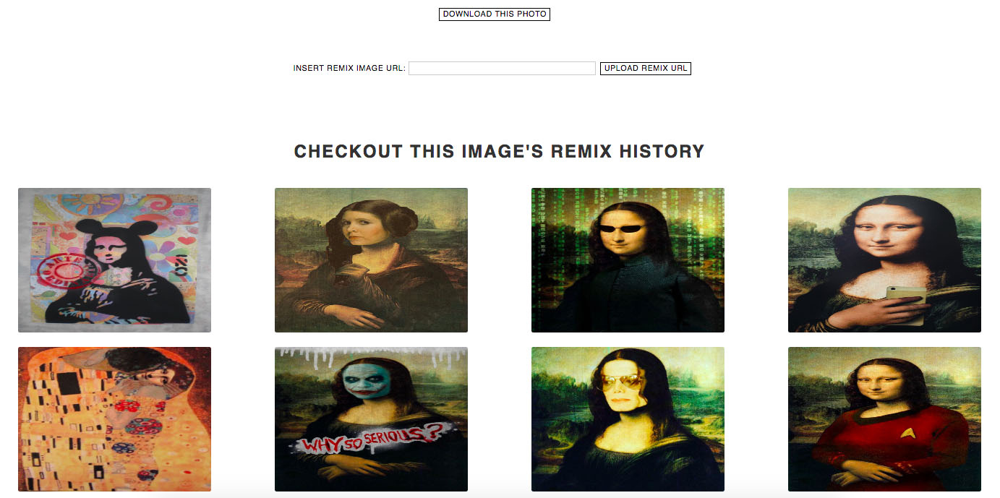

<h1 align="center"> REMIX </h1> <br>
<p align="center">
  <a href="https://dc-remix.herokuapp.com/">
    
  </a>
</p>

<p align="center">
  A space to create and re-create
</p>


## Table of Contents

- [Introduction](#introduction)
- [Features](#features)
- [Installation](#installation)
- [Contributors](#contributors)

## Introduction

Remix culture, sometimes read-write culture, is a society that allows and encourages derivative works by combining or editing existing materials to produce a new creative work or product.

REMIX is a fantastic way to share ideas, get you inspired, and keep up with creativity!


## Features

A few of the things you can do with REMIX:

* Register and login
* Receive Welcome email
* View original image in gallery
* View other users' remixes
* Upload your remix
* View your history of remixes


<p align="center">
  
</p>

<p align="center">
  
</p>

<p align="center">
  
</p>

<p align="center">
  
</p>

<p align="center">
  
</p>

<p align="center">
  
</p>

## Installation

### Remix

```
express remix && cd remix && npm install
```
```
npm install axios bcrypt body-parser dotenv
npm install express-session hbs nodemailer
npm install nodemailer-express-handlers passport passport-local
npm install pg sequelize sequelize-cli
```

`script` in `package.json`:

```
{
  "name": "remix",
  "version": "0.0.0",
  "private": true,
  "scripts": {
    "start": "node ./bin/www",
    "postinstall": "cd client && npm install && npm run build"
  },
  "dependencies": {
    "axios": "^0.18.0",
    "bcrypt": "^3.0.0",
    "body-parser": "^1.18.3",
    "cookie-parser": "~1.4.3",
    "cors": "^2.8.4",
    "debug": "~2.6.9",
    "dotenv": "^6.0.0",
    "express": "~4.16.0",
    "express-fileupload": "^0.4.0",
    "express-session": "^1.15.6",
    "hbs": "^4.0.1",
    "http-errors": "~1.6.2",
    "jade": "~1.11.0",
    "morgan": "~1.9.0",
    "nodemailer": "^4.6.7",
    "nodemailer-express-handlebars": "^3.0.0",
    "passport": "^0.4.0",
    "passport-local": "^1.0.0",
    "pg": "^7.4.3",
    "sequelize": "^4.38.0",
    "sequelize-cli": "^4.0.0"
  }
}
```

### Client

```
create-react-app client && cd client && npm install
```
```
npm install react-router-dom redux react-redux axios redux-form
```
 `script` in `package.json`:

```
{
  "name": "client",
  "version": "0.1.0",
  "private": true,
  "dependencies": {
    "axios": "^0.18.0",
    "react": "^16.4.1",
    "react-dom": "^16.4.1",
    "react-redux": "^5.0.7",
    "react-router-dom": "^4.3.1",
    "react-scripts": "1.1.4",
    "redux": "^4.0.0",
    "redux-form": "^7.4.2"
  },
  "scripts": {
    "start": "react-scripts start",
    "build": "react-scripts build",
    "test": "react-scripts test --env=jsdom",
    "eject": "react-scripts eject"
  },
  "proxy": "http://localhost:3001"
}
```


## Contributors

 by [CRYSTAL SILLS](https://github.com/csills)
 & [HYUN JOO NAM](https://github.com/hyunjoonam)
